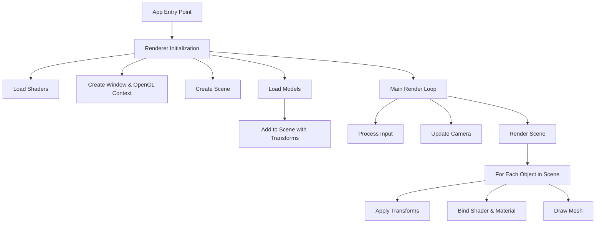

# 3D Renderer Technical Documentation

## Table of Contents
1. [Architecture Overview](#architecture-overview)
2. [Rendering Pipeline](#rendering-pipeline)
3. [Shader System](#shader-system)
4. [Camera System](#camera-system)
5. [Vertex and Buffer Management](#vertex-and-buffer-management)
6. [Performance Considerations](#performance-considerations)
7. [Extending the Renderer](#extending-the-renderer)

## Architecture Overview

The renderer is built using a modular architecture with these key components:

- **Main Renderer Class**: Manages the OpenGL context, window, and overall rendering loop
- **Shader System**: Handles GLSL shader compilation and linking
- **Camera System**: Manages view and projection matrices, handles user input
- **Buffer Management**: Handles vertex and index buffer objects (VBOs/IBOs)
- **Scene Management**: The `Scene` class manages all 3D objects, their transforms, and hierarchy
  - Tracks models with their positions, rotations, and scales
  - Provides methods for adding/removing objects
  - Maintains a clean separation between rendering and object management

### High-Level Architecture Diagram



This diagram summarizes the main flow from app startup to rendering each frame.

## Scene Management

The renderer uses a `Scene` class to manage all 3D objects in the world. This provides a clean separation between rendering logic and object management.

### Key Features
- **Object Management**: Add/remove models with a simple API
- **Transform Hierarchy**: Each object maintains its own position, rotation, and scale
- **Separation of Concerns**: Scene handles object management while Renderer focuses on rendering

### Usage Example
```python
# Create a renderer and load a model
renderer = Renderer()
renderer.load_model('my_model', 'model.obj', 
                   position=[0, 0, -5], 
                   rotation=[0, 0, 0],
                   scale=1.0)

# The model is automatically added to renderer.scene
assert 'my_model' in renderer.scene.objects

# Access and modify scene objects
obj = renderer.scene.objects['my_model']
obj['position'][0] += 1.0  # Move right
```

## Rendering Pipeline

The rendering process follows the standard graphics pipeline:

1. **Application Stage**
   - Update game logic
   - Process user input
   - Update object transformations

2. **Geometry Stage**
   - Vertex Shader: Transforms vertices from model space to clip space
   - Primitive Assembly: Groups vertices into triangles
   - Clipping: Removes geometry outside the view frustum
   - Rasterization: Converts primitives into fragments

3. **Fragment Stage**
   - Fragment Shader: Determines the color of each fragment
   - Depth Testing: Handles visibility determination
   - Blending: Combines fragment colors with the framebuffer

## Shader System

The renderer uses GLSL shaders for programmable pipeline stages:

### Vertex Shader (`src/shaders/textured.vert`)
- **Input**: Vertex attributes (position, normal, texcoord)
- **Output**: Transformed position, interpolated normal, and texcoord
- **Key Operations**:
  - Applies model-view-projection matrix
  - Passes normal and texture coordinates to fragment shader

### Fragment Shader (`src/shaders/textured.frag`)
- **Input**: Interpolated vertex data (normal, texcoord)
- **Output**: Final fragment color
- **Key Operations**:
  - Applies physically-based lighting using Material and Light structs
  - Handles both textured and untextured materials
  - Samples texture using texcoords if enabled
  - Performs all calculations in world space

---

## How Shaders and Models Interact

In this renderer (and in most modern engines):
- **Models** contain mesh geometry and reference a material.
- **Materials** specify which shader to use and provide parameters (e.g., textures, colors).
- When rendering, the engine:
    1. Binds the shader program from the material.
    2. Sets material parameters (uniforms, textures).
    3. Draws the model’s mesh.
- Multiple models can share the same material/shader, just with different parameters.

**Code Example:**
```python
# Load a model and its material
renderer.load_model('cube', 'models/textured_cube.obj')
# ...
# In the render loop (simplified):
for model_name in renderer.models:
    model = renderer.models[model_name]
    prog = renderer.prog  # The shader program
    # Set uniforms like view/projection matrices, camera position, etc.
    prog['view'].write(view_matrix)
    prog['projection'].write(proj_matrix)
    # Set material properties
    if hasattr(model, 'material'):
        prog['material.ambient'].value = tuple(model.material.ambient)
        # ... (other material uniforms)
    # Draw the model (binds texture, draws VAO)
    model.draw(prog)
```

---

## Walkthrough: Loading a Model and the Render Loop

### 1. Loading a Model
```python
renderer = Renderer()
renderer.load_model('cube', 'models/textured_cube.obj')
```
- Loads the OBJ mesh and associated material/texture.
- Creates GPU buffers (VBO/IBO/VAO) for the mesh.
- Prepares the model for rendering.

### 2. The Render Loop (Simplified)
```python
def render(self):
    while not glfw.window_should_close(self.window):
        self._process_input()
        self._update_camera()
        
        # Render all objects in the scene
        for name, obj in self.scene.get_objects():
            self.render_model(name, 
                           obj.get('position'), 
                           obj.get('rotation'), 
                           obj.get('scale'))
                            
        glfw.swap_buffers(self.window)
        glfw.poll_events()
```
- Handles input and camera movement
- Iterates through all objects in the scene
- Renders each object with its individual transforms
- Swaps display buffers and processes window events

For more, see the `renderer.py` source and the test walkthrough in `tests/render_model/README.md`.

## Camera System

The camera system implements a first-person camera with:
- **Position**: 3D location in world space
- **Orientation**: Defined by yaw and pitch angles
- **View Frustum**: Defined by field of view and aspect ratio
- **Movement**: WASD controls with speed boost (Shift key)
- **Looking**: Mouse movement controls view direction

Key matrices:
- **View Matrix**: Transforms from world space to camera space
- **Projection Matrix**: Defines the view frustum (perspective)

## Vertex and Buffer Management

### Vertex Format
Each vertex contains:
- Position (3 floats: x, y, z)
- Normal (3 floats: nx, ny, nz)
- Texture Coordinates (2 floats: u, v)

### Buffer Objects
- **VBO (Vertex Buffer Object)**: Stores vertex data on GPU
- **IBO/EBO (Index Buffer Object)**: Stores vertex indices for indexed rendering
- **VAO (Vertex Array Object)**: Stores vertex attribute configurations

### Memory Management
- Buffers are created once during initialization
- Data is stored in GPU memory for optimal performance
- Indexed rendering reduces memory usage by reusing vertices

## Frame Rate Control

The renderer includes an optional frame rate limiting feature that helps manage system resources and provide consistent performance:

### Features
- **Configurable Target FPS**: Set any target FPS (e.g., 30, 60, 144) or 0 for unlimited
- **Efficient Waiting**: Uses `glfw.wait_events_timeout()` to sleep efficiently while still processing events
- **Automatic Calculation**: Frame time is automatically calculated based on the target FPS
- **Dynamic Adjustment**: Can be changed at runtime if needed

### Usage
```python
# Create a renderer with 60 FPS target
renderer = Renderer(target_fps=60)

# For unlimited FPS (default)
renderer = Renderer()  # or renderer = Renderer(target_fps=0)

# Change FPS at runtime (if needed)
renderer.target_fps = 30
renderer.frame_time = 1.0 / 30 if renderer.target_fps > 0 else 0
```

### Benefits
- **Reduced Power Consumption**: Prevents unnecessary rendering when monitor can't display additional frames
- **Consistent Performance**: Provides more predictable performance across different hardware
- **Thermal Management**: Helps manage heat generation by limiting GPU/CPU usage
- **Battery Life**: Extends battery life on laptops and mobile devices

## Performance Considerations

1. **Frame Rate Limiting**
   - Consider enabling FPS limiting for non-interactive applications
   - Match target FPS to your monitor's refresh rate for optimal performance
   - Disable (set to 0) when benchmarking or when maximum performance is needed

2. **Minimize State Changes**
   - Group objects by shader/material
   - Use instancing for repeated objects

2. **Efficient Data Transfer**
   - Use buffer objects instead of immediate mode
   - Batch draw calls when possible

3. **GPU Optimizations**
   - Enable face culling for closed meshes
   - Use depth testing for proper occlusion
   - Consider level-of-detail (LOD) for complex scenes

## Extending the Renderer

### Adding New Features
1. **Textures**
   - Texture coordinates and diffuse textures are fully supported
   - OBJ/MTL loader parses and loads texture references
   - Fragment shader samples textures if enabled in the material

2. **Lighting & Materials**
   - Lighting is computed using Material and Light structs for flexibility
   - Materials support ambient, diffuse, specular, shininess, and texture use
   - Lighting model is Phong/Blinn-Phong
   - Include normal mapping for detailed surfaces

3. **Post-Processing**
   - Implement framebuffer objects (FBOs)
   - Add effects like bloom, SSAO, or motion blur

### Optimizations
- Implement frustum culling
- Add spatial partitioning (Octree/BVH)
- Implement level-of-detail (LOD) system

## Troubleshooting

### Common Issues
1. **Black Screen**
   - Check shader compilation logs
   - Verify vertex attribute locations
   - Ensure proper matrix multiplication order

2. **Performance Problems**
   - Profile draw calls and state changes
   - Check for unnecessary buffer updates
   - Verify proper culling is enabled

3. **Visual Artifacts**
   - Check depth testing settings
   - Verify winding order of triangles
   - Check for z-fighting with proper depth buffer precision
